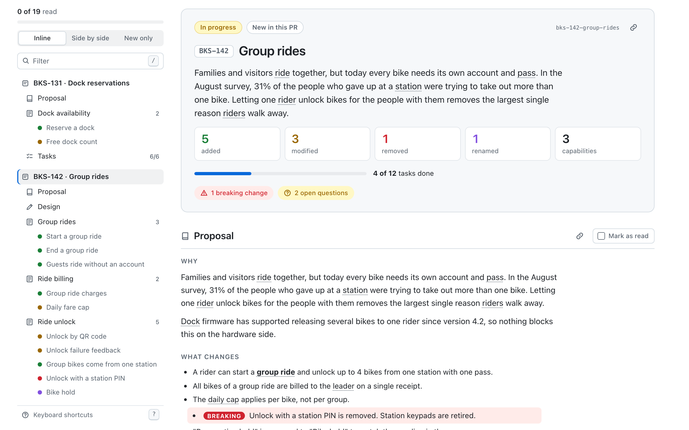
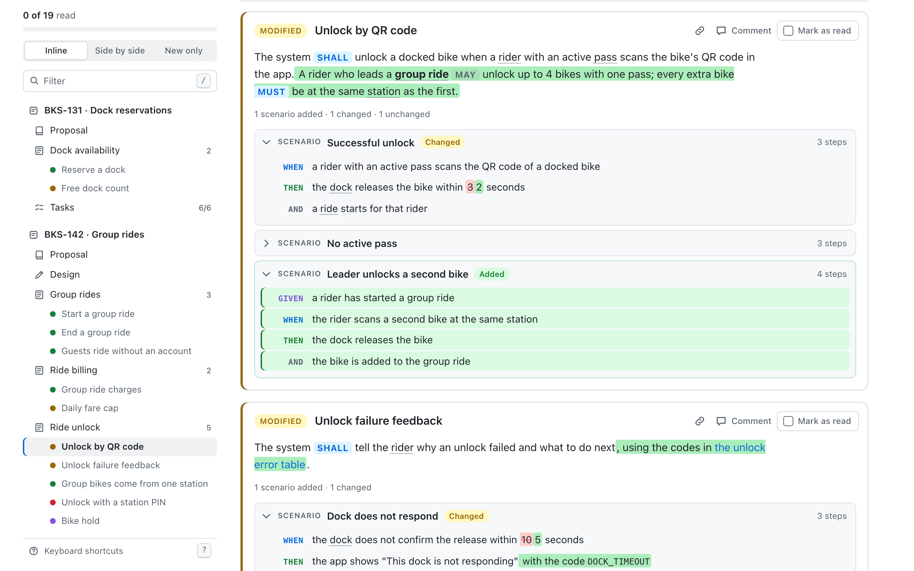
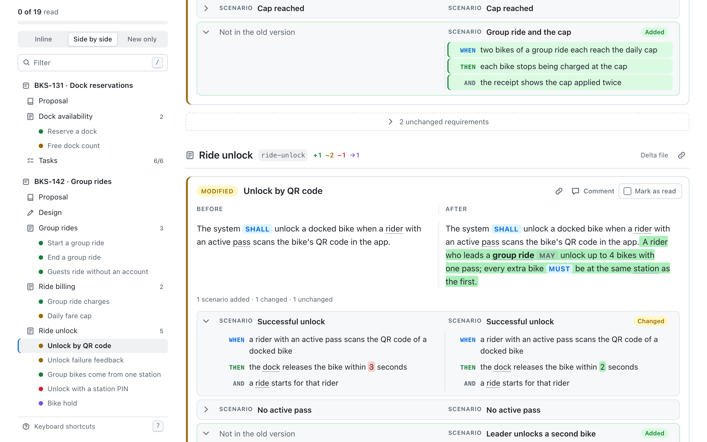
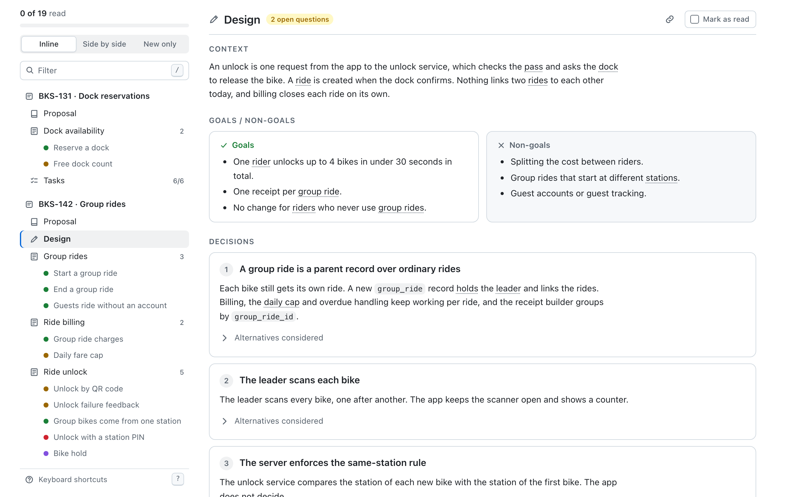
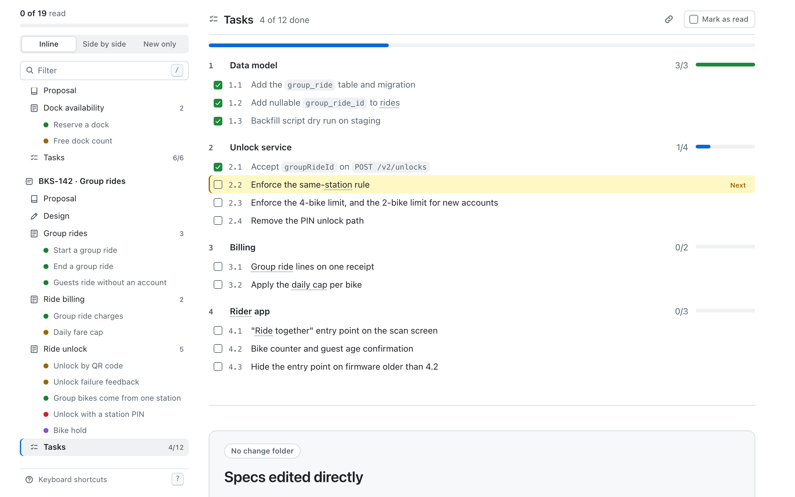
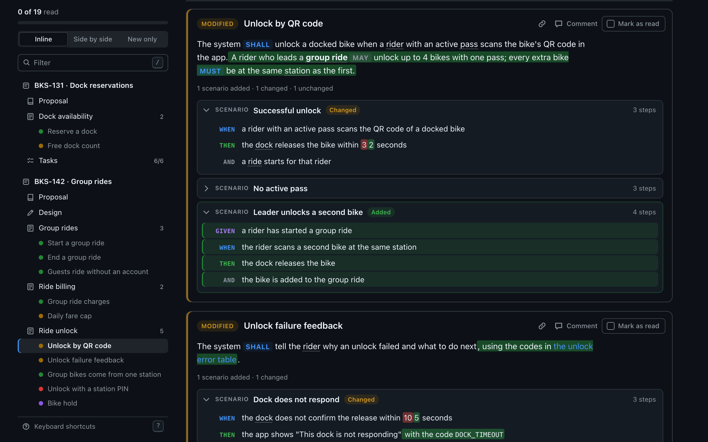

# OpenSpec Tab for GitHub

A browser extension that adds an **OpenSpec** tab to GitHub pull requests, right after "Files changed".

The tab shows the [OpenSpec](https://github.com/Fission-AI/OpenSpec) changes in the pull request (everything under `openspec/`) as requirements and scenarios you can read and review, instead of raw Markdown diffs you open one file at a time.



The pictures on this page show made-up data from the fixtures in this repository.

## What the tab shows

**Each change, top to bottom:** an overview card, the proposal, the design, one section per spec with its requirements, and the tasks. A sticky outline on the left follows you as you scroll.

**Modified requirements, three ways.** A `MODIFIED` requirement in OpenSpec is the full replacement text, so GitHub shows it as all new. The tab compares it with the requirement in the base spec and shows what actually changed:



- **Inline:** removed words struck, added words highlighted, on the rendered text (bold, code and links are kept).
- **Side by side:** old against new, aligned scenario by scenario and step by step.
- **New only:** the new text, clean.



Scenarios that were added, removed or changed are marked. Press `1`, `2` or `3` to switch.

**Everything else on a requirement card**

- A coloured label: added, modified, removed or renamed.
- SHALL, MUST, SHOULD and MAY styled so obligations stand out.
- A link you can copy that points at this requirement.
- "Comment", which opens the changed line in "Files changed" so you can leave a review comment.
- Removed requirements show their old text dimmed, with Reason and Migration as callouts. Renamed ones show "old → new".
- Requirements the change does not touch fold into "N unchanged requirements".

**Proposal and design, structured**



- Proposal: Why, What Changes, Capabilities and Impact as separate blocks. Capability names jump to their spec, file paths link to the files, breaking changes are flagged.
- Design: goals beside non-goals, each decision as a card with its alternatives folded, risks against mitigations, open questions called out.
- `*.excalidraw.svg` files in the change folder are shown inline, with zoom.

**Tasks**



**Review progress.** "Mark as read" on each section and requirement, remembered per pull request in your browser. If the author pushes a change to something you marked, it is flagged as changed since you read it.

**Glossary.** If the repository has `docs/CONTEXT.md` (or `CONTEXT.md`), its terms are underlined in the text and show their definition on hover. Words the glossary says to avoid are underlined differently.

**Format problems.** A requirement with no scenario, a `MODIFIED` requirement that matches nothing in the base spec, a `FROM:` without a `TO:` and similar mistakes are shown next to the requirement they concern. A file the tab cannot read as OpenSpec is shown as plain rendered Markdown.

**Themes.** The tab uses GitHub's own colours, so it follows light, dark and dimmed themes.



### What counts as a change

| In the pull request | Shown as | Before | After |
| --- | --- | --- | --- |
| A change folder under `openspec/changes/` | In progress | The spec on the base branch | The base spec with the deltas applied |
| A change moved to `openspec/changes/archive/` | Archived in this PR | The spec on the base branch | What the change's deltas produce |
| A spec edited with no change folder | Specs edited directly | The spec on the base branch | The spec on the PR branch |

Several changes in one pull request are shown one after another. Changes archived in the same pull request are applied in date order, so a later one is compared with the result of the earlier one. Anything in a spec that the changes do not account for appears under "Specs edited directly".

The number on the tab is the count of requirement changes. A pull request with no OpenSpec files shows 0 and an empty state.

### Keyboard

| Key | Action |
| --- | --- |
| `j` / `k` | Next / previous section or requirement |
| `m` | Mark the current one as read |
| `1` `2` `3` | Inline, side by side, new only |
| `/` | Filter the outline |
| `?` | Help |

## Install

The extension is not in the browser stores yet. Build it and load it unpacked.

```bash
pnpm install
pnpm build
```

**Chrome, Edge, Brave, Arc**

1. Open `chrome://extensions`.
2. Turn on **Developer mode**.
3. Choose **Load unpacked** and pick the `.output/chrome-mv3` folder.

**Firefox**

```bash
pnpm build:firefox
```

Open `about:debugging#/runtime/this-firefox`, choose **Load Temporary Add-on** and pick `.output/firefox-mv2/manifest.json`. The Firefox build compiles but has not been tested yet.

Then open any pull request on github.com.

## Private repositories: add a token

Public repositories work with no setup. For a private repository the tab needs a read-only token, because it asks GitHub's API which OpenSpec files the pull request changes.

1. Open [GitHub → Settings → Developer settings → Fine-grained tokens → Generate new token](https://github.com/settings/personal-access-tokens/new).
2. **Resource owner:** the user or organisation that owns the repositories. **Repository access:** the repositories you review.
3. **Repository permissions:** set **Contents** and **Pull requests** to **Read-only**. Nothing else.
4. Generate the token. An organisation may have to approve it first.
5. Open the extension's settings (the **Add a token** button in the tab, or the extension's "Options") and paste it.

Without a token the tab still shows up on private repositories and tells you a token is needed.

## How it works

**Adding the tab.** GitHub serves two pull request tab bars, a React one and the classic one. Both are found by their accessible names, and the new tab is a clone of a native tab, so it looks right in either. The tab is re-added after GitHub's soft navigations and re-renders. While it is open, the native tab content is hidden, not removed.

**The URL.** The tab lives in the hash: `…/pull/123#openspec`, or `#openspec/<change>/<section>` for a link to one requirement. A hash is never sent to GitHub, so reload, back/forward and shared links work.

**Reading the pull request.** Four small API calls: the pull request, its merge base, and the `openspec/` tree at the merge base and at the head. Changed files are found by comparing the two trees, so a pull request with hundreds of other files costs the same as a small one. File contents are then read from github.com with your signed-in session, falling back to the API.

**OpenSpec rules.** The parsers follow the reference implementation in `@fission-ai/openspec` 1.14: delta section headers are case-insensitive and may repeat, lines inside code fences are ignored, and requirement names match exactly. A name that differs only in case or spacing is treated as a mistake and flagged, as the CLI does. A contract test runs the real CLI on the fixtures and compares results.

## Permissions and privacy

- `https://github.com/*`: to add the tab and read files with your session.
- `https://api.github.com/*`: to ask which OpenSpec files a pull request changes.
- `storage`: for the token, your review progress and your view preference.

The token is kept in the browser's extension storage. Only the extension's background worker reads it, and it attaches it only to requests to api.github.com that are on the tab's short allowlist. It is never put in a URL, never logged and never given to a web page. Nothing is sent anywhere except GitHub.

Markdown from the repository is rendered without raw HTML: any HTML in a spec is shown as text, and only `http`, `https` and `mailto` links are followed.

## Limits

- Only github.com, not GitHub Enterprise Server.
- The OpenSpec folder must be `openspec/` at the repository root.
- Without a token GitHub allows 60 API requests an hour per network address. A pull request view uses four, and repositories with no `openspec/` folder use none.
- The tab relies on GitHub's page structure, which GitHub can change. `scripts/smoke.ts` checks it against the live site.

## Development

```bash
pnpm dev          # run the extension with live reload
pnpm build        # production build in .output/chrome-mv3
pnpm zip          # zip for the store
pnpm test         # unit tests and the contract test against the real OpenSpec CLI
pnpm lint         # Biome
pnpm typecheck    # TypeScript
pnpm harness      # the tab on a plain page with fixture data, at http://localhost:5199
pnpm screenshots  # every view in light and dark, into docs/screenshots
```

`pnpm screenshots` needs Playwright's browser once: `pnpm exec playwright install chromium`.

To check the built extension against the live site:

```bash
pnpm build && pnpm exec tsx scripts/smoke.ts https://github.com/Fission-AI/OpenSpec/pull/2012
```

**Where things are**

| Path | What |
| --- | --- |
| `src/openspec/` | Parsers, delta application and the pull request model. No browser APIs. |
| `src/diff/` | Word-level diff and scenario and step alignment. |
| `src/github/` | URL scheme, API access, the loader, tab injection. |
| `src/ui/` | The React view and its stylesheet. |
| `src/entrypoints/` | Background worker, content script, settings page. |
| `harness/` | The dev harness page. |
| `fixtures/` | Synthetic OpenSpec repositories used by tests, harness and screenshots. |

**Fixtures.** Everything under `fixtures/` is invented (a bike-share service). Please keep it that way: do not add content from real private repositories.

## License

[MIT](LICENSE)
