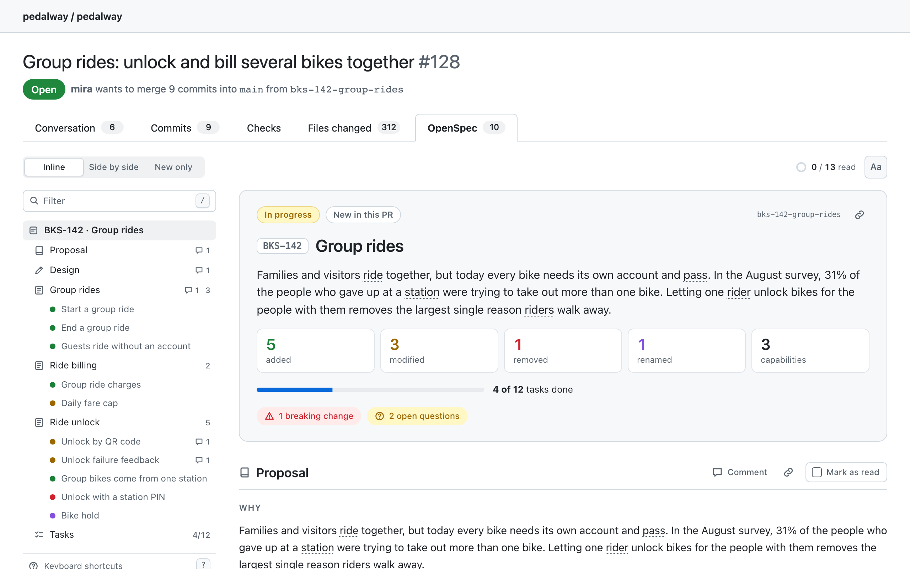
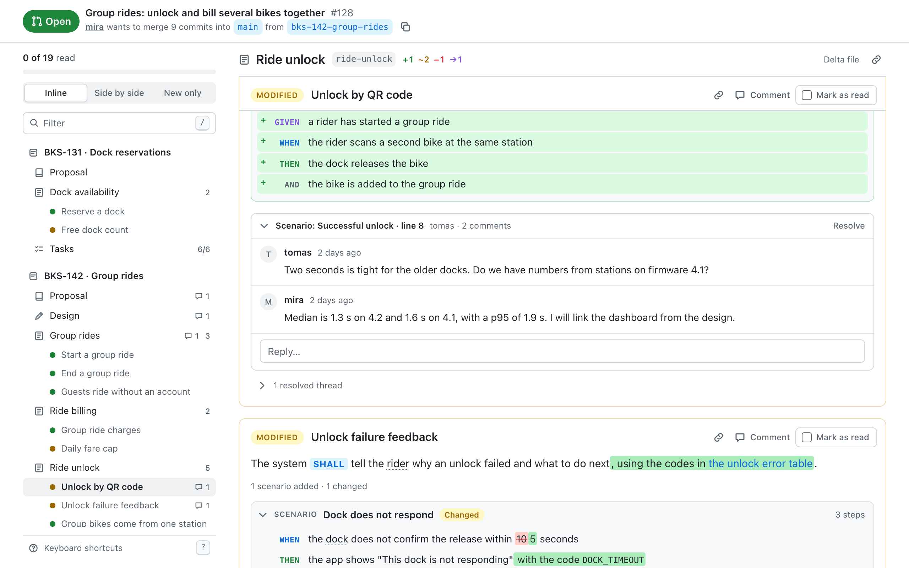

<div align="center">


# OpenSpec Tab for GitHub

**Review [OpenSpec](https://github.com/Fission-AI/OpenSpec) changes as requirements and scenarios, right inside the pull request.**

A browser extension that adds an **OpenSpec** tab to every GitHub pull request, next to "Files changed".

[](LICENSE)


</div>

<picture>
  <source media="(prefers-color-scheme: dark)" srcset="docs/readme/hero-dark.png">
  
</picture>

<table>
  <tr>
    <td width="50%">
      <picture>
        <source media="(prefers-color-scheme: dark)" srcset="docs/readme/modified-inline-dark.png">
        
      </picture>
    </td>
    <td width="50%">
      <picture>
        <source media="(prefers-color-scheme: dark)" srcset="docs/readme/modified-split-dark.png">
        
      </picture>
    </td>
  </tr>
  <tr>
    <td align="center"><sub>What changed in a requirement, word by word</sub></td>
    <td align="center"><sub>Or side by side, aligned step by step</sub></td>
  </tr>
</table>

<sub>All pictures show made-up data from the fixtures in this repository.</sub>

## Why

Reviewing an OpenSpec change on GitHub means reading raw Markdown diffs:

- You click "Display the rich diff" on every file, one at a time.
- A `MODIFIED` requirement is a full replacement, so the diff shows it as all new. You cannot see what actually changed.
- There is no side-by-side view of rendered Markdown.

This tab reads the same files and shows them the way a reviewer thinks about them: what is the change, which requirements does it add, modify, remove or rename, and what exactly is different.

## What you get

- **An overview of each change:** a readable name, whether it is in progress or archived in this pull request, how many requirements it adds, modifies, removes and renames, task progress, and the first paragraph of "Why".
- **Modified requirements, three ways:** word-level changes on the rendered text, side by side, or the new version only. Scenarios that were added, removed or changed are marked.
- **Requirement cards:** a coloured label for the change type, SHALL / MUST / SHOULD / MAY styled so obligations stand out, a link you can copy, and "Comment", which opens the changed line in "Files changed".
- **Scenarios as compact rows:** WHEN, THEN and AND in a keyword column, each scenario folded under its name.
- **Removed and renamed requirements:** removed text is dimmed, with Reason and Migration as callouts. Renames show "old → new".
- **Context without noise:** requirements the change does not touch fold into "N unchanged requirements".
- **A structured proposal and design:** capability names jump to their spec, file paths link to the files, breaking changes are flagged, decisions are cards with their alternatives folded, risks sit beside their mitigations, and open questions are called out.
- **Diagrams:** `*.excalidraw.svg` files in the change folder are shown inline, with zoom.
- **Tasks:** progress overall and per group, with the next unchecked task highlighted.
- **Review comments, in place:** the pull request's review threads appear on the requirement, scenario, decision or section they were left on, and the outline counts the ones still open. With a token you can comment, reply and resolve from the tab, publish a comment at once or keep it in a pending review, and submit the review with a verdict.
- **Review progress:** "Mark as read" on each section and requirement, remembered per pull request. If the author pushes a change to something you marked, it is flagged as changed since you read it.
- **Glossary on hover:** if the repository has `docs/CONTEXT.md` (or `CONTEXT.md`), its terms are underlined and show their definition. Words the glossary says to avoid are underlined differently.
- **Format problems, inline:** a requirement with no scenario, a `MODIFIED` requirement that matches nothing in the base spec, a `FROM:` without a `TO:`. A file that cannot be read as OpenSpec is shown as plain rendered Markdown.
- **A sticky outline** with a filter and keyboard navigation.
- **Headers that stay in view:** a compact pull request header (state, title, branches) stays at the top of the window, like the one on GitHub's own tabs, whichever page you open the tab from. Below it, the header of the section you are in and of the requirement you are reading stick while you scroll, with "Comment" and "Mark as read" in reach.
- **GitHub's own look:** the tab uses GitHub's colours, so it follows the light, dark and dimmed themes.

<table>
  <tr>
    <td width="50%"></td>
    <td width="50%"></td>
  </tr>
  <tr>
    <td align="center"><sub>The design: goals beside non-goals, decisions as cards</sub></td>
    <td align="center"><sub>Tasks, with the next one highlighted</sub></td>
  </tr>
  <tr>
    <td width="50%"></td>
    <td width="50%"></td>
  </tr>
  <tr>
    <td align="center"><sub>The overview of a change</sub></td>
    <td align="center"><sub>Review threads, on the requirement they are about</sub></td>
  </tr>
</table>

## Install

The extension is not in the browser stores yet. Build it and load it unpacked. You need [Node.js](https://nodejs.org) 22 or later and [pnpm](https://pnpm.io).

```bash
git clone https://github.com/nikrabaev/github-openspec-tab.git
cd github-openspec-tab
pnpm install
pnpm build
```

**Chrome, Edge, Brave, Arc**

1. Open `chrome://extensions`.
2. Turn on **Developer mode**.
3. Choose **Load unpacked** and pick the `.output/chrome-mv3` folder.

**Firefox**

Run `pnpm build:firefox`, open `about:debugging#/runtime/this-firefox`, choose **Load Temporary Add-on** and pick `.output/firefox-mv2/manifest.json`. The Firefox build is in daily use, but the automated smoke test only drives Chromium.

Then open any pull request on github.com and choose the **OpenSpec** tab.

**Updating:** pull and build again (`pnpm build`, or `pnpm build:firefox`), reload the extension, then refresh the pull request page. In Chrome, press the reload button on the extension's card in `chrome://extensions`; in Firefox, press **Reload** next to the extension in `about:debugging#/runtime/this-firefox`. Refreshing the page alone is not enough: the browser keeps running parts of the build it loaded before, and the tab then mixes old and new code.

## Private repositories

Public repositories work with no setup. For a private repository the tab needs a token, because it asks GitHub's API which OpenSpec files the pull request changes.

1. Open [GitHub → Settings → Developer settings → Fine-grained tokens → Generate new token](https://github.com/settings/personal-access-tokens/new).
2. **Resource owner:** the user or organisation that owns the repositories. **Repository access:** the repositories you review.
3. **Repository permissions:** set **Contents** to **Read-only**, and **Pull requests** to **Read and write** if you want to comment from the tab, or **Read-only** if you only want to read. Nothing else. (Resolving threads from the tab would need more: see [Review comments](#review-comments).)
4. Generate the token. An organisation may have to approve it first.
5. Open the extension's settings (the **Add a token** button in the tab, or the extension's "Options") and paste it.

Without a token the tab still shows up on a private repository and tells you one is needed.

## Review comments

The tab shows the pull request's review threads where they belong: on a requirement card (with the scenario a thread is on), in the block or decision of the proposal and design, under a task group, or with the file for a comment on the file as a whole. Resolved threads, and threads left on text that has since changed, fold into one line.

| | Without a token | Pull requests: Read-only | Pull requests: Read and write | Also Contents: Read and write |
| --- | --- | --- | --- | --- |
| See threads | Public repositories | Yes | Yes | Yes |
| See which are resolved | No | Yes | Yes | Yes |
| Comment, reply, submit a review | No | No | Yes | Yes |
| Resolve and unresolve threads | No | No | No | Yes |

The last column is GitHub's rule, not the tab's: it lets a fine-grained token resolve a thread only if the token could also push code. If you would rather not give it that, the tab says so the first time you try, and from then on each thread's "Resolve" opens the thread on GitHub.

Writing works like GitHub's own review:

- **Comment** publishes at once. **Start a review** keeps the comment private until you submit the review; while a review is in progress, everything you write joins it.
- **Finish review**, in the outline, submits the pending review as a comment, an approval or a request for changes. It publishes every pending comment of the review, including ones you left on other files in GitHub's own view.
- GitHub takes a line comment only on a line that is part of the diff. When it turns the line down (a requirement that was only moved, for example), the comment is left on the file as a whole and opens with what it is about.

Editing and deleting comments, reactions and suggestions are left to GitHub: each comment's date links to it there.

## Keyboard

| Key | Action |
| --- | --- |
| `j` / `k` | Next / previous section or requirement |
| `m` | Mark the current one as read |
| `1` `2` `3` | Inline, side by side, new only |
| `/` | Filter the outline |
| `?` | Help |

## What counts as a change

| In the pull request | Shown as | Before | After |
| --- | --- | --- | --- |
| A change folder under `openspec/changes/` | In progress | The spec on the base branch | The base spec with the deltas applied |
| A change moved to `openspec/changes/archive/` | Archived in this PR | The spec on the base branch | What the change's deltas produce |
| A spec edited with no change folder | Specs edited directly | The spec on the base branch | The spec on the PR branch |

Several changes in one pull request are shown one after another. Changes archived in the same pull request are applied in date order, so a later one is compared with the result of the earlier one. Anything in a spec that the changes do not account for appears under "Specs edited directly".

The number on the tab is the count of requirement changes. A pull request with no OpenSpec files shows 0 and an empty state.

## How it works

**Adding the tab.** GitHub serves two pull request tab bars, a React one and the classic one. Both are found by their accessible names, and the new tab is a clone of a native tab, so it looks right in either. The tab is re-added after GitHub's soft navigations and re-renders. While it is open, the native tab content is hidden, not removed.

On the React page the tab waits until React has taken over the HTML the server sent. Added earlier, it would make React discard the page content and render it a second time. Only a script in the page's own context can see when that is, so the extension runs a second, very small content script there (`react-probe`) that answers this one question and does nothing else.

**The URL.** The tab lives in the hash: `…/pull/123#openspec`, or `#openspec/<change>/<section>` for a link to one requirement. A hash is never sent to GitHub, so reload, back/forward and shared links work.

**Review comments.** With a token, one GraphQL query reads the threads, and a fixed set of GraphQL mutations writes: the page names an operation and sends its variables, and the background worker holds the documents, so nothing else can be run with the token. Without a token, a public repository's comments are read through the REST API. After every write the threads are read again, so the tab shows what GitHub holds.

**Reading the pull request.** Four small API calls: the pull request, its merge base, and the `openspec/` tree at the merge base and at the head. Changed files are found by comparing the two trees, so a pull request with hundreds of other files costs the same as a small one. File contents are then read from github.com with your signed-in session, falling back to the API.

**OpenSpec rules.** The parsers follow the reference implementation in `@fission-ai/openspec` 1.14: delta section headers are case-insensitive and may repeat, lines inside code fences are ignored, and requirement names match exactly. A name that differs only in case or spacing is treated as a mistake and flagged, as the CLI does. A contract test runs the real CLI on the fixtures and compares results.

## Permissions and privacy

| Permission | Why |
| --- | --- |
| `https://github.com/*` | Add the tab and read files with your session |
| `https://api.github.com/*` | Ask which OpenSpec files a pull request changes; read and write review comments |
| `storage` | Keep the token, your review progress and your view preference |

The token is kept in the browser's extension storage. Only the extension's background worker reads it, and it attaches it only to requests to api.github.com that are on the tab's short allowlist: a handful of read-only REST paths, and the named review-comment operations. It is never put in a URL, never logged and never given to a web page. Nothing is sent anywhere except GitHub, and nothing is written to GitHub except the comments, replies, resolutions and reviews you submit yourself.

Comment text is rendered like the specs are: without raw HTML.

Markdown from the repository is rendered without raw HTML: any HTML in a spec is shown as text, and only `http`, `https` and `mailto` links are followed.

## Limits

- Only github.com, not GitHub Enterprise Server.
- The OpenSpec folder must be `openspec/` at the repository root.
- Without a token GitHub allows 60 API requests an hour per network address. A pull request view uses five (four for the pull request, one for its comments), and repositories with no `openspec/` folder use none.
- A thread on a removed line (the old side of the diff), or on a line that a later commit changed, is shown with its file rather than on a requirement.
- The tab relies on GitHub's page structure, which GitHub can change. `scripts/smoke.ts` checks it against the live site.

## Development

```bash
pnpm dev          # run the extension with live reload
pnpm build        # production build in .output/chrome-mv3
pnpm zip          # zip for the store
pnpm test         # unit tests and the contract test against the real OpenSpec CLI
pnpm lint         # Biome
pnpm typecheck    # TypeScript
pnpm harness      # the tab on a plain page with fixture data, at http://localhost:5199
pnpm screenshots  # every view in light and dark, into docs/screenshots
```

`pnpm screenshots` needs Playwright's browser once: `pnpm exec playwright install chromium`.

To check the built extension against the live site:

```bash
pnpm build && pnpm exec tsx scripts/smoke.ts https://github.com/Fission-AI/OpenSpec/pull/2012
```

| Path | What |
| --- | --- |
| `src/openspec/` | Parsers, delta application and the pull request model. No browser APIs. |
| `src/diff/` | Word-level diff and scenario and step alignment. |
| `src/github/` | URL scheme, API access, the loader, tab injection. |
| `src/ui/` | The React view and its stylesheet. |
| `src/entrypoints/` | Background worker, content script, page script, settings page. |
| `harness/` | The dev harness page. |
| `fixtures/` | Synthetic OpenSpec repositories used by tests, harness and screenshots. |

Everything under `fixtures/` is invented (a bike-share service). Please keep it that way: do not add content from real private repositories.

## License

[MIT](LICENSE)
